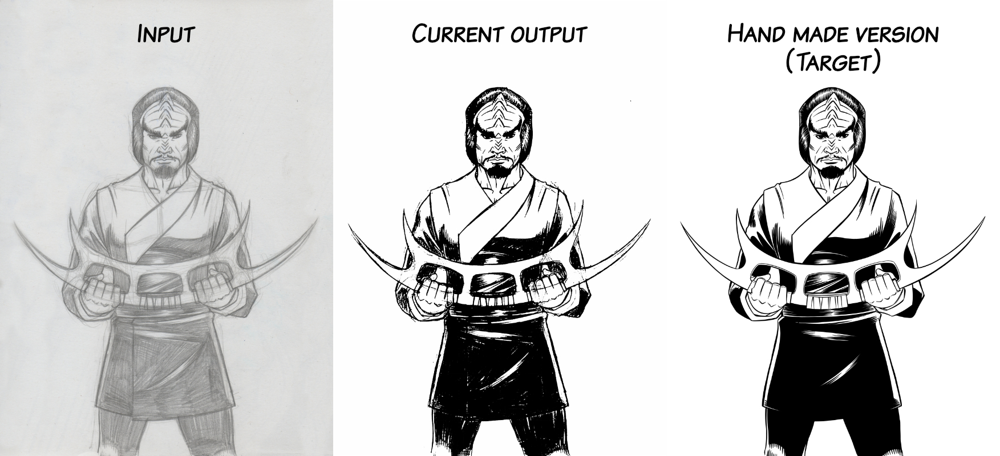
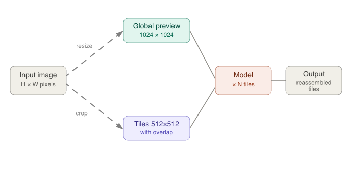

# Pagaille

Pagaille is a collection of Deep Learning image filtering models aimed at automating repetitive artistic tasks.

## Overview

Being both an engineer and an artist (and a comic book author), I have always developed tools to automate repetitive tasks so I can focus on those with higher creative value. Classical programming methods and procedural generation algorithms having their limits, I decided to explore deep learning.

The targeted features:
- Inking a pencil sketch
- Flat coloring a lineart from small color spots
- The list will grow as ideas come

I developed a global-local architecture because fine details (such as whether to draw a thick or thin stroke) are intimately tied to a global understanding of the image.

My datasets are exclusively based on my own drawings and illustrations.

## Current results

 

## Architecture

The model is based on a dual-branch architecture. The global branch receives the full illustration and extracts six levels of feature maps capturing the stylistic and structural context of the entire drawing. The local branch independently processes each 512×512 tile through an eight-level encoder producing skip connections, a bottleneck, and a symmetric decoder. The global features are injected into the local branch through a fusion layer (1×1 convolution + bilinear interpolation) that aligns both branches before concatenation with the skip connections — allowing the decoder to reconstruct each tile while accounting for both local detail and the overall coherence of the drawing. The output is a 512×512 inked tile normalized via a Tanh activation.

 

During inference, the pencil sketch is on one hand resized to a 1024×1024 overview, and on the other hand split into overlapping 512×512 tiles. Inference is performed on each tile individually. The model takes both the current tile and the global overview as input. Finally, the inferred tiles are reassembled into the full image.

 

## Tech stack

- Python 3.10
- PyTorch 2.2.2
- OpenCV 4.9 / Albumentations
- GPU training via AMD Metal/MPS (2019 16-inch MacBook Pro)

## Status

🚧 Actively in development — early results are promising.

- My Inktober 2022 sketches are far too clean, which gives the model a very literal understanding of the strokes, causing it to tend to interpret construction lines as lines to be inked.

- Idea to explore: training an inverse model that infers a pencil sketch from an inked drawing, which would allow me to generate pencil versions from inked drawings for which I no longer have the original sketch — and thus enrich the dataset for training the inking model.
